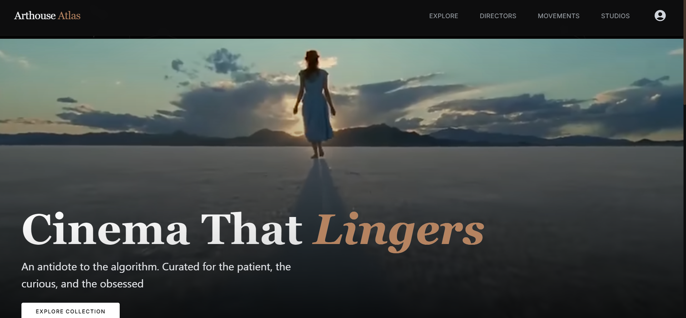

# Arthouse Atlas

> A curated discovery platform for world cinema — built for cinephiles, not algorithms.

🔗 **Live Site:** [arthouse-atlas.vercel.app](https://arthouse-atlas.vercel.app)



---

## What is Arthouse Atlas?

**Arthouse Atlas** is a full-stack MERN application that curates ~500 of cinema's greatest arthouse films and organises them across three discovery lenses — Directors, Movements, and Studios. It goes beyond a simple movie list by building a personalised layer on top: a recommendation engine that learns your taste from your Favorites, Watchlist, and Watched history.

---

## Features

### 🎬 Discovery
- **Explore** — A masonry grid of 497 curated films with real-time filtering by Genre, Decade, Director, and custom mood tags. Includes a Shuffle mode.
- **The Auteurs** — Director profiles with B&W portraits, filmographies, and career overviews.
- **Movements** — Full-screen scroll layout for 12 cinematic movements (German Expressionism → Mumblecore) with essential films and key figures.
- **Studios** — Curated production houses and distributors that define arthouse cinema.

### 🎯 Personalisation
- **For You** — A weighted affinity recommendation engine. Scores 200 candidate films across 4 dimensions: derived tags (×1.5), directors (+20 flat), cinematic movements (×2.0), and decade affinity (+5). Weighted by interaction type — Favorites (3×), Watched (1.5×), Watchlist (1×).
- **Watchlist** — Save films to watch later.
- **Favorites** — Like films to train your recommendation profile.
- **Watched** — Mark films as seen to exclude them from future picks.

### 🎟️ Watch Movie
- Per-film streaming availability sourced from TMDB, filtered to India and US regions. Provider logos are clickable and route to a Google search for the film on that platform.

### 🔐 Authentication
- JWT-based email/password login
- Google OAuth 2.0 (one-click sign in)

---

## Tech Stack

| Layer | Technology |
|---|---|
| Frontend | React 18 (Vite), Tailwind CSS |
| Backend | Node.js, Express.js |
| Database | MongoDB (Mongoose ODM) |
| Auth | JWT, Google OAuth 2.0 |
| APIs | TMDB (streaming data, trailers) |
| Deployment | Vercel (frontend), Render (backend) |

---

## Local Setup

### 1. Clone
```bash
git clone https://github.com/DiwakarMishra-CODER/Arthouse-Atlas.git
cd Arthouse-Atlas
```

### 2. Install dependencies
```bash
cd backend && npm install
cd ../frontend && npm install
```

### 3. Environment variables

**`backend/.env`**
```env
PORT=5000
MONGODB_URI=your_mongodb_connection_string
JWT_SECRET=your_jwt_secret
GOOGLE_CLIENT_ID=your_google_client_id
```

**`frontend/.env.local`** (for local dev — never committed)
```env
VITE_API_URL=http://localhost:5000/api
VITE_GOOGLE_CLIENT_ID=your_google_client_id
VITE_TMDB_API_KEY=your_tmdb_api_key
```

### 4. Run
```bash
# Terminal 1 — Backend
cd backend && npm run dev

# Terminal 2 — Frontend
cd frontend && npm run dev
```

App runs at `http://localhost:5173`

---

## Project Structure

```
Arthouse-Atlas/
├── backend/
│   ├── controllers/     # Route handlers (movies, users, auth)
│   ├── models/          # Mongoose schemas (Movie, User)
│   ├── routes/          # Express route definitions
│   ├── services/        # Recommendation engine, scoring algorithms
│   ├── middleware/       # JWT auth guard
│   └── scripts/         # DB seeding and enrichment scripts
└── frontend/
    ├── src/
    │   ├── pages/       # Home, Explore, Directors, Movements, MovieDetail, etc.
    │   ├── components/  # PosterCard, Navbar, HeroFeature, FilterPanel, etc.
    │   ├── context/     # AuthContext, MovieContext (global state)
    │   └── services/    # Axios API client
```

---

## License

MIT
